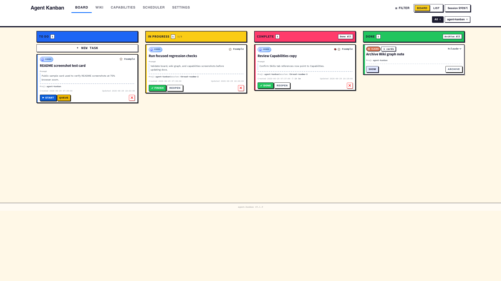
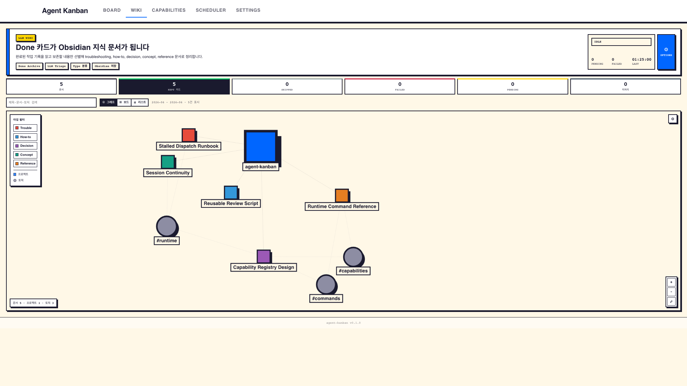
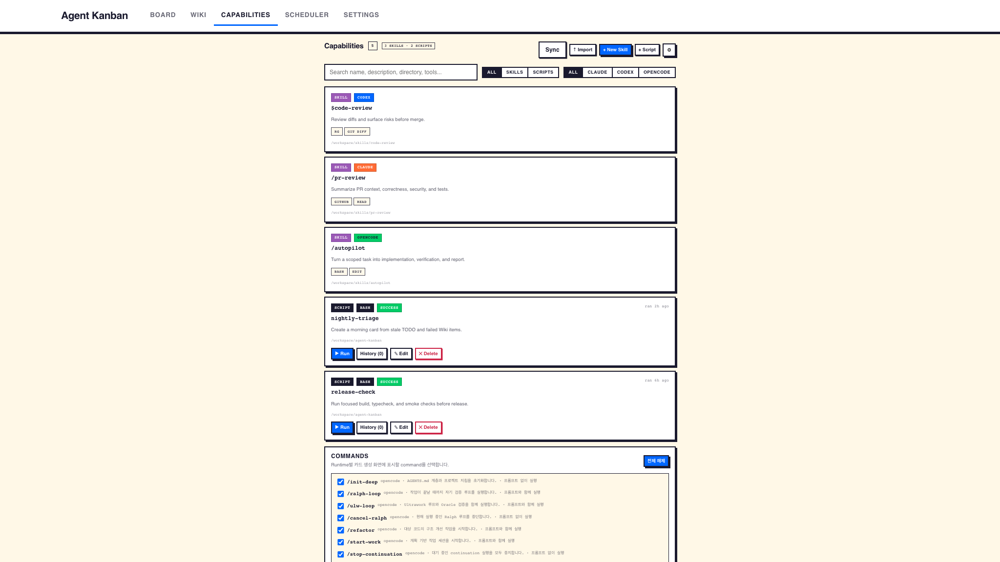

# agent-kanban

`agent-kanban`은 opencode, Codex, Claude로 처리하는 AI 코딩 작업을 카드로 추적하는 local-first kanban dashboard입니다. 여러 AI CLI 세션을 한 보드에서 보고, follow-up을 올바른 세션에 이어 붙이고, 반복 사용 가능한 Capabilities를 관리하며, 완료된 작업을 Obsidian용 LLM Wiki 문서로 남길 수 있습니다.

프로젝트는 Bun 기반 plugin/runtime과 React/Vite 웹 앱으로 구성됩니다. 런타임 데이터는 기본적으로 `~/.agent-kanban/` 아래 JSON 파일로 저장되며, 별도 hosted service 없이 로컬에서 확인, 백업, 삭제할 수 있습니다.



> 스크린샷은 Chrome 75% zoom 기준의 공개용 샘플 데이터로 만든 이미지이며 실제 로컬 보드 데이터가 아닙니다.

## 왜 필요한가

AI CLI 작업은 터미널 출력, 세션 히스토리, 후속 메시지, 결과 요약이 쉽게 흩어집니다. `agent-kanban`은 그 작업을 다음 흐름으로 보이게 만듭니다.

- **Board**: AI 작업을 `TODO`, `IN PROGRESS`, `COMPLETE`, `DONE` 카드로 추적합니다.
- **Runtime dispatch**: 수동 카드 실행 시 opencode, Codex, Claude runtime을 선택합니다.
- **Session continuity**: runtime별 session id를 보존해 follow-up과 retry를 이어갑니다.
- **Queueing**: TODO 카드를 순차 실행하고, 필요하면 이전 카드 세션을 이어받습니다.
- **Capabilities**: Codex, Claude, opencode skills와 로컬 scripts를 한 탭에서 검색, 동기화, 생성, 실행합니다.
- **Scheduler**: 반복 작업을 cron 또는 자연어 일정으로 등록해 실행합니다.
- **Telegram follow-up**: Telegram 메시지를 선택된 세션으로 다시 라우팅합니다. 봇 생성과 토큰 등록 절차는 [Getting started의 Telegram 연동](./docs/getting-started.md#telegram-연동)을 참고하세요.
- **LLM Wiki**: 아카이브된 DONE 카드를 재사용 가능한 Markdown 지식으로 요약합니다.
- **Neo-brutalism UI**: 굵은 테두리, 강한 그림자, 선명한 상태 색상을 유지합니다.

## 스크린샷

### Board

상단 스크린샷이 기본 작업 보드입니다. `COMPLETE`는 AI 실행이 끝났지만 사람이 검토해야 하는 상태이고, `DONE`은 결과를 확인해 아카이브할 수 있는 상태입니다.

### LLM Wiki Graph

Wiki 탭은 Graph를 첫 화면으로 열어 아카이브된 작업, 생성된 문서, 프로젝트, 토픽의 관계를 한눈에 보여줍니다.



### Capabilities

Capabilities 탭은 user-authored skills와 로컬 scripts를 같은 실행 자산으로 다룹니다.



## 요구사항

- **Bun**: package manager와 runtime입니다. 미설치 시 `curl -fsSL https://bun.sh/install | bash`로 설치한 뒤 셸을 재시작하세요. `scripts/install.sh`는 bun이 없으면 설치 안내와 함께 중단됩니다.
- **Node.js 18+**: Playwright와 일부 개발 도구에서 필요합니다.
- **Git**: 저장소 clone과 업데이트에 필요합니다.
- **opencode CLI**: opencode plugin/runtime으로 사용할 때 필요합니다.
- **Codex CLI**: 선택 사항입니다. Codex runtime dispatch와 `gpt-*` Wiki 모델에 필요합니다.
- **Claude CLI / Claude Code**: 선택 사항입니다. Claude runtime dispatch와 non-`gpt-*` Wiki 모델에 필요합니다.
- **jq**: 권장 사항입니다. `scripts/install.sh`가 전역 Claude/Codex hook 설정을 안전하게 갱신할 때 사용합니다.

## 설치

```bash
git clone https://github.com/hjyyessh-ux/agent-kanban.git
cd agent-kanban
bun install
./scripts/install.sh
```

`./scripts/install.sh`는 build를 실행한 뒤 opencode plugin bundle과 Claude Code / Codex hook을 등록합니다.

- opencode plugin: `~/.config/opencode/plugins/agent-kanban/`
- Claude Code hooks: `~/.agent-kanban/hooks/`
- Codex hooks: `~/.agent-kanban/codex-hooks/`
- daemon project pointer: `~/.agent-kanban/daemon-project-path`

설치 후 opencode, Claude Code, Codex를 재시작해야 plugin/hook 설정이 다시 로드됩니다.

설치가 끝나면 `bun start`로 데몬을 직접 실행하거나, 새 opencode/Claude Code/Codex 세션을 시작해 데몬을 자동 기동시킨 뒤 브라우저에서 `http://localhost:24680`을 엽니다. 설치 스크립트 완료 메시지에도 동일한 안내가 출력됩니다.

설치된 hook과 plugin 참조를 제거하려면 다음 명령을 실행합니다.

```bash
./scripts/install.sh --uninstall
```

## 실행

기본 보드 주소는 다음과 같습니다.

```text
http://localhost:24680
```

opencode plugin으로 로드되면 서버가 자동으로 시작됩니다. Codex 또는 Claude Code hook만 사용하는 경우에는 새 세션이 시작될 때 background daemon이 실행됩니다.

로컬 개발에서는 backend와 frontend를 별도 터미널에서 실행합니다.

```bash
# Terminal 1
bun start       # standalone daemon (기본 진입점)

# Terminal 2
bun run dev
```

Vite 앱은 `http://localhost:5173`에서 실행되고 API 요청을 `http://localhost:24680`으로 proxy합니다.

## 빠른 시작

1. `http://localhost:24680`에서 보드를 엽니다.
2. UI에서 task를 만들거나, hook 설치 후 AI 세션을 시작합니다.
3. 수동 task는 `opencode`, `codex`, `claude` 중 하나의 runtime을 선택합니다.
4. AI 실행이 끝난 카드는 검토 후 `COMPLETE`에서 `DONE`으로 옮깁니다.
5. 보드에서 치우고 싶은 `DONE` 카드는 archive합니다.
6. 반복해서 쓰는 skill이나 script는 Capabilities에서 동기화하고 관리합니다.
7. 완료 작업을 지식 문서로 남기고 싶으면 LLM Wiki를 활성화합니다.

## LLM Wiki

LLM Wiki는 완료된 작업을 재사용 가능한 Markdown 문서로 바꾸는 기능입니다. 아카이브된 카드를 읽고, 같은 세션의 카드를 그룹화한 뒤, triage/classification pipeline을 통해 보존할 가치가 있는 내용을 Obsidian-compatible vault에 씁니다.

Wiki 탭의 기본 화면은 Graph입니다. Graph는 생성 문서, 프로젝트, 토픽 노드를 연결해 어떤 작업이 어떤 지식으로 축적됐는지 먼저 보여주며, 필요하면 같은 화면에서 보드/리스트 보기로 전환할 수 있습니다.

생성되는 문서 타입은 다음과 같습니다.

- `troubleshooting`
- `howto`
- `decision`
- `concept`
- `reference`

Wiki 문서는 사용자가 직접 지정한 Obsidian vault 안의 폴더에 저장됩니다. 기본 경로는 제공하지 않으며, 최초 설정에서 저장 폴더를 입력해야 합니다.

지정한 폴더 아래에는 다음 구조가 생성됩니다.

```text
<your-wiki-directory>/
├── index.md
├── log.md
├── troubleshooting/
├── howto/
├── decision/
├── concept/
└── reference/
```

### Wiki 설정

`Wiki` 탭 → `Options` → `Settings`에서 값을 저장합니다.

| 설정 | 기본값 | 의미 |
|---|---:|---|
| Enabled | `false` | 기본 OFF입니다. 켜기 전까지 token을 쓰지 않습니다. |
| Model | `gpt-5.5` | triage와 classification에 사용할 모델입니다. |
| Effort | `medium` | `low`, `medium`, `high`, `xhigh` 중 하나입니다. |
| Vault path | 사용자 입력 필수 | 생성된 Markdown 파일을 쓸 Obsidian vault 안의 Wiki 전용 디렉터리입니다. 없으면 활성화 시 생성됩니다. |

설정값은 `KANBAN_DATA_DIR`을 바꾸지 않았다면 `~/.agent-kanban/settings.json`에 저장됩니다.

### Worker 동작

Wiki worker는 scheduler와 background service를 담당하는 singleton runtime owner에서만 실행됩니다. 60초마다 pending Wiki card를 확인하고, archive, backfill, reprocess, restart, 활성화 직후에는 즉시 한 번 더 실행됩니다.

모델 라우팅은 모델명 기준입니다.

| 모델 패턴 | Route | Command shape |
|---|---|---|
| `gpt-*` | Codex | `codex exec --json -m <model> -c model_reasoning_effort="<effort>" -s read-only ...` |
| 그 외 | Claude | `claude -p --output-format json --model <model> --effort <effort>` |

신규 처리분부터 archived card의 Wiki state와 worker log에 `model`, `route`, `effort`가 함께 기록됩니다. 이후 UI에서도 어떤 LLM 경로로 처리됐는지 확실히 보여줄 수 있습니다.

### Backfill

`Backfill latest 500`은 아카이브된 카드 중 Wiki state가 없거나, 실패했거나, 현재 prompt version보다 오래된 후보를 최신순으로 최대 500개까지 다시 pending queue에 올리는 기능입니다.

여기서 500개는 **문서 수가 아니라 카드 수**입니다. 같은 세션에 속한 여러 카드가 하나의 문서로 묶일 수 있으므로 실제 생성 문서 수는 더 적을 수 있습니다. 이미 현재 버전으로 처리된 문서는 일반 backfill로 다시 쓰지 않으며, 의도적으로 다시 생성하려면 개별 reprocess를 사용합니다.

## Capabilities

Capabilities는 기존 Skills 중심 화면을 확장한 통합 실행 자산 탭입니다. Codex, Claude, opencode에서 발견한 skills와 `KANBAN_DATA_DIR/scripts/` 아래 동기화된 scripts를 하나의 목록으로 보여줍니다.

주요 기능은 다음과 같습니다.

- **Skill discovery**: `~/.claude/skills`, `~/.codex/skills`, `~/.codex/skills/.system`, `~/.agents/skills`와 사용자가 추가한 skill root를 스캔합니다.
- **Skill authoring**: 새 skill 생성, `SKILL.md` import, 기존 skill duplicate, skill content edit를 제공합니다.
- **Script management**: 로컬 script 생성, 수정, 실행, 실행 이력 확인, runtime storage sync를 제공합니다.
- **Filtering**: `All`, `Skills`, `Scripts` 타입 필터와 `claude`, `codex`, `opencode` runtime 필터를 제공합니다.
- **Command visibility**: 카드 생성 화면에 표시할 runtime command를 선택해 자주 쓰는 command만 남길 수 있습니다.

## 설정

| Environment variable | Default | Description |
|---|---|---|
| `KANBAN_PORT` | `24680` | HTTP server base port입니다. 사용 중이면 다음 포트를 순차적으로 시도합니다. |
| `KANBAN_DATA_DIR` | `~/.agent-kanban` | board state, settings, archive, run artifact, screenshot, hook, token 저장 경로입니다. |

기본 데이터 구조는 다음과 같습니다.

```text
~/.agent-kanban/
├── active.json
├── archive/
├── runtime-runs/
├── schedulers.json
├── screenshots/
├── scripts.json
├── settings.json
├── telegram-state.json
├── hooks/
├── codex-hooks/
├── daemon-project-path
└── .peer-token
```

## 개발

```bash
bun run build       # backend(daemon+plugin)와 web UI build
bun start           # standalone daemon 실행 (기본 진입점)
bun run dev         # Vite dev server on 5173
bun run dev:plugin  # opencode plugin runtime 직접 실행
bunx tsc --noEmit   # typecheck
bun test            # unit/integration tests
bun run test:e2e    # Playwright specs
```

workflow 관련 변경은 아래 targeted test부터 확인하는 편이 빠릅니다.

```bash
bun test src/__tests__/workflow-regression.test.ts
bun test src/__tests__/telegram-poller.test.ts
bun test src/__tests__/feedback-session-reuse.test.ts
```

## 보안

- HTTP server는 기본적으로 `127.0.0.1`에 bind됩니다.
- 변경성 API와 민감 API는 `~/.agent-kanban/.peer-token`의 local bearer token을 요구합니다.
- `TELEGRAM_BOT_TOKEN` 같은 secret은 `settings.json`에 plaintext JSON으로 저장됩니다.
- network exposure를 켜면 server가 `0.0.0.0`에 bind됩니다. 신뢰할 수 있는 네트워크에서만 사용하세요.

자세한 threat model과 control은 [SECURITY.md](./SECURITY.md)를 참고하세요.

## 문서

- [Getting started](./docs/getting-started.md)
- [Kanban board](./docs/kanban-board.md)
- [Scheduler](./docs/scheduler.md)
- [Plugin tools](./docs/plugin-tools.md)
- [API reference](./docs/api-reference.md)
- [Architecture](./docs/architecture.md)
- [Workflow invariants](./docs/invariants.md)

## 기여

Issue와 pull request를 환영합니다. 큰 변경은 workflow, persistence format, runtime side effect가 엮일 수 있으므로 먼저 issue로 방향을 맞추는 것을 권장합니다.

PR을 열기 전에는 변경 범위에 맞는 가장 작은 test와 `bunx tsc --noEmit`을 실행해 주세요.

## License

MIT. [LICENSE](./LICENSE)를 참고하세요.
