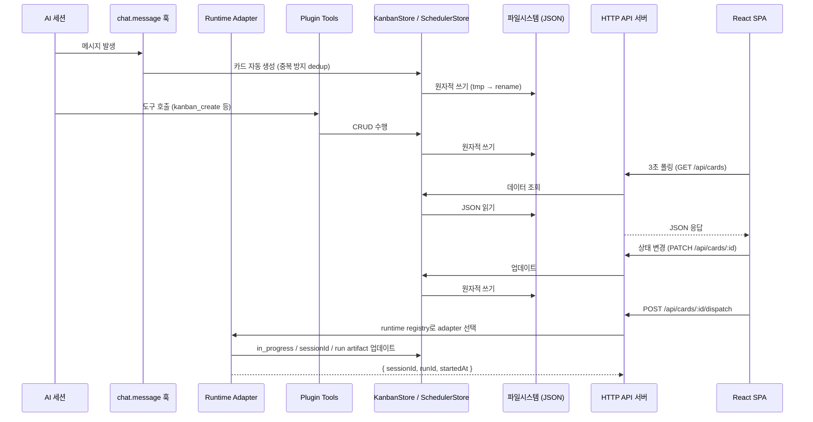

# 아키텍처 개요

## 개요

agent-kanban은 세 개의 레이어와 runtime adapter 하위 시스템으로 구성된다.

```
┌─────────────────────────────────────────┐
│  Plugin Layer (opencode 플러그인)         │
│  tools + hooks + runtime adapters         │
└──────────────┬──────────────────────────┘
               │ HTTP
┌──────────────▼──────────────────────────┐
│  Server Layer (Bun HTTP API)             │
│  18개 라우트, 파일시스템 JSON 영속성       │
└──────────────┬──────────────────────────┘
               │ fetch (3초 폴링)
┌──────────────▼──────────────────────────┐
│  Web UI Layer (React SPA)               │
│  Neobrutalism 스타일, 탭 네비게이션       │
└─────────────────────────────────────────┘
```

플러그인이 opencode 안에서 실행되며 카드, runtime dispatch, Telegram follow-up 상태, question 흐름을 관리한다. HTTP 서버가 데이터를 파일시스템 JSON으로 저장하고 REST API를 노출한다. React SPA가 폴링으로 서버 데이터를 가져와 보드, 스케줄러, 스크립트, 설정, 질문 UI를 렌더링한다.

카드 실행 runtime은 `agentRuntime`으로 구분한다. 값이 없는 legacy card는 `opencode`로 해석한다.

Capabilities의 MCP 설정 runtime은 별도 `McpRuntime`(`claude` | `codex`)으로 구분한다. Claude adapter는 기존 JSON parser/writer와 CLI fallback을 그대로 사용하고, Codex adapter는 `config.toml`의 선택된 `[mcp_servers.*]` table만 수정한다. runtime이 없던 persisted placement target과 MCP API 요청은 Claude로 해석하며, inventory key는 `runtime:name`이다. Skill scanner의 Claude/Codex/Opencode 식별과 scan/dedup 계약은 이 경계와 독립적으로 유지된다.

Mutation route는 runtime과 exact placement identity를 확인한 뒤 Claude 기존 writer 또는 Codex TOML writer 중 하나만 호출한다. Preview는 순수 변환으로 diff를 계산하고 apply에서만 lock/backup/atomic write를 수행한다. Codex cross-file move는 원본 제거 실패 시 동시 변경이 없는 대상만 rollback한다. Cold storage는 runtime과 원 placement를 manifest/registry에 보존한다.

Codex inventory reader는 등록 target마다 git/project root → target directory의 config chain을 만들고 가까운 layer를 effective definition으로 표시한다. Project trust는 required/status unknown 진단으로만 노출하며 실제 신뢰 상태를 추론하지 않는다. Runtime discovery는 fail-open으로 합쳐져 malformed Codex TOML이 Claude MCP나 기존 Skill inventory 응답을 차단하지 않는다.

---

## 기술 스택

| 구분 | 기술 | 비고 |
|------|------|------|
| 런타임 | Bun | 빌드, 테스트, 서버 모두 Bun 사용 |
| HTTP 서버 | Bun.serve() | 외부 프레임워크 없음 |
| 프론트엔드 | React 19 + Vite | SPA, 라우터 없음 |
| 스타일링 | 순수 CSS + CSS Custom Properties | Tailwind/CSS-in-JS/CSS Modules 금지 |
| UI 디자인 | Neobrutalism | 굵은 테두리, 강한 그림자, 선명한 색상 |
| 영속성 | 파일시스템 JSON | 데이터베이스 없음 |
| Cron | croner v10.0.1 | 경량 스케줄러 라이브러리 |
| 빌드 도구 | Bun build (플러그인), Vite (웹 UI) | |
| 테스트 | bun test + Playwright | 회귀/단위/통합 + 브라우저 테스트 |
| 언어 | TypeScript (strict mode) | |

---

## 프로젝트 구조

```
src/
├── core/                    # 핵심 타입, 저장소, 파일 잠금, cron 파서, agent defaults
│   ├── types.ts             # KanbanCard / Runtime / Scheduler / Settings / Script / Telegram state
│   ├── runtime-config.ts    # runtime catalog, model catalog, legacy default resolver
│   ├── store.ts             # active board + archive + screenshots
│   ├── scheduler-store.ts   # scheduler persistence
│   ├── settings-store.ts    # runtime settings persistence
│   ├── script-store.ts      # synced scripts + run history
│   ├── telegram-state-store.ts # Telegram selected session / sticky defaults
│   ├── filelock.ts          # cross-process file lock
│   ├── mcp-config-store.ts  # 기존 Claude JSON/.mcp.json parser/writer + CLI fallback
│   ├── codex-mcp-config.ts  # Codex config.toml MCP 전용 surgical writer
│   ├── mcp-runtime-adapter.ts # Claude/Codex MCP inventory/write strategy
│   └── cron-parser.ts       # 자연어 cron 변환, 검증, 설명 생성
├── plugin/                  # 백엔드 런타임 (공유 부트스트랩 + opencode 플러그인 레이어)
│   ├── index.ts             # store → runtime registry → tools → hooks → monitors
│   ├── server.ts            # ServerMonitor — 자동 복구 서버
│   ├── scheduler-engine.ts  # scheduler runtime
│   ├── question-monitor.ts  # pending question bridge
│   ├── telegram-*.ts        # poller / commands / notifier / reminder
│   ├── runtimes/            # AgentRuntime adapters + RuntimeRunStore
│   ├── tools/               # kanban / scheduler / settings tool factories
│   └── hooks/               # chat.message / event / command hooks
├── server/                  # HTTP 서버
│   ├── index.ts             # Bun.serve() 서버 생성
│   └── routes.ts            # cards, schedulers, settings, scripts, screenshots, models, questions
└── __tests__/               # 회귀/유닛/통합 테스트

web/
└── src/
    ├── App.tsx              # Board / Scheduler / Scripts / Settings shell
    ├── components/          # Board / Card / Scheduler / Scripts / Settings / Question
    ├── hooks/               # API 클라이언트 + reducer hooks + polling
    └── styles/              # CSS 토큰 + 컴포넌트 스타일

e2e/                         # Playwright browser tests
├── fixtures/                # seedCard, trackCard 픽스처
└── helpers/                 # API 헬퍼 함수
```

---

## 데이터 흐름



데이터 흐름의 핵심은 단방향성이다. 상태는 항상 파일시스템 JSON이 원본이며, UI는 폴링으로 최신 상태를 가져온다. 실시간 푸시(WebSocket, SSE)는 사용하지 않는다.

---

## 영속성 시스템

### 데이터 디렉토리

기본 경로는 `~/.agent-kanban/`이다. `KANBAN_DATA_DIR` 환경변수로 변경할 수 있다.

```
~/.agent-kanban/
├── active.json          # 활성 칸반 보드
├── schedulers.json      # 스케줄러 항목
├── settings.json        # 설정 항목
├── scripts.json         # 스크립트와 실행 이력
├── telegram-state.json  # Telegram selected session / sticky defaults
├── runtime-runs/        # Codex/Claude run index + run artifacts
├── archive/             # 월별 아카이브
└── screenshots/         # 업로드 파일
```

### RuntimeRunStore

`RuntimeRunStore`는 `src/plugin/runtimes/runtime-run-store.ts`에 있다. 저장 위치는 `KANBAN_DATA_DIR/runtime-runs/`이며, `runs.json`이 run index를 보관한다.

각 run은 `runtime-runs/<runId>/` 아래에 다음 artifact를 남긴다.

| 파일 | 설명 |
|------|------|
| `prompt.md` | runtime으로 전달한 prompt |
| `events.jsonl` | Codex JSONL 또는 Claude stream-json 이벤트 |
| `stderr.log` | subprocess stderr |
| `last-message.md` | adapter가 card result로 사용할 최종 메시지 |

`RuntimeRunStore.reconcileStale(store)`는 플러그인 재시작 시 `starting`/`running` run을 `failed`로 정리하고, 연결된 `in_progress` card를 `todo`로 되돌린다.

### 원자적 쓰기

파일에 직접 쓰면 쓰기 도중 크래시가 발생할 때 데이터가 손상된다. 이를 방지하기 위해 임시 파일에 먼저 쓰고, 완료 후 rename으로 교체한다.

```
1. 데이터를 .active.json.tmp에 직렬화하여 쓰기
2. renameSync(.active.json.tmp, active.json) 호출
3. rename은 원자적 — 중간 상태가 없음
```

### 레거시 마이그레이션

초기 버전은 `board.json`을 사용했다. 현재는 `store.load()` 호출 시 `board.json`이 존재하면 자동으로 `active.json`으로 변환하고 `board.json.bak`으로 백업한다.

---

## 이중 잠금 메커니즘

여러 프로세스가 동시에 같은 파일에 쓰려고 할 때 데이터 충돌이 발생한다. 이를 막기 위해 두 단계의 잠금을 사용한다.

### 1단계: 프로세스 내 뮤텍스

같은 프로세스 내에서 비동기 쓰기 작업이 동시에 실행되는 상황을 막는다. Promise 체인으로 직렬화하여 쓰기 작업이 순서대로 실행된다.

```
쓰기 요청 A ─┐
              ├─ Promise 체인 → A 완료 후 B 실행
쓰기 요청 B ─┘
```

### 2단계: 크로스프로세스 파일 잠금

다른 프로세스(예: 두 개의 opencode 세션)가 동시에 접근하는 상황을 막는다. `O_CREAT|O_EXCL` 플래그로 `.lock` 파일을 생성하여 잠금을 획득한다. `.lock` 파일이 이미 존재하면 다른 프로세스가 잠금을 보유한 것이므로 대기한다.

두 잠금 모두 획득해야만 실제 쓰기가 진행된다.

---

## 서버 자동 복구 (ServerMonitor)

플러그인이 실행되는 동안 HTTP 서버가 크래시되면 Web UI가 데이터를 가져올 수 없다. `ServerMonitor`가 이를 자동으로 복구한다.

- `/api/board` 엔드포인트를 10초 간격으로 폴링
- 응답이 없으면 자동으로 새 서버 인스턴스를 시작
- 포트 충돌 시 최대 3개 연속 포트 시도 (기본 24680 → 24681 → 24682)

포트 우선순위는 `KANBAN_PORT` 환경변수로 기본값을 변경할 수 있다.

---

## 프론트엔드 아키텍처

### 구조

단일 페이지 앱으로 라우터가 없다. `App.tsx`의 `activeTab` 상태가 Board 뷰와 Scheduler 뷰 전환을 담당한다.

```
App.tsx
├── activeTab === 'board'      → Board 컴포넌트 트리
│   ├── KanbanBoard
│   ├── KanbanColumn (x4)
│   └── KanbanCard / CardDetailModal
└── activeTab === 'scheduler'  → Scheduler 컴포넌트 트리
    ├── SchedulerView
    ├── SchedulerJobModal
    └── SchedulerHistoryPanel
```

### 상태 관리

React Query나 SWR 같은 외부 상태 관리 라이브러리를 사용하지 않는다. 각 뷰는 `useReducer`로 로컬 상태를 관리하고, 3초 폴링으로 서버에서 최신 데이터를 가져온다.

```
useKanbanBoard
├── useReducer (board 상태)
├── usePolling (3초 간격)
└── useKanbanApi (fetch 래퍼)

useScheduler
├── useReducer (scheduler 상태)
├── usePolling (3초 간격)
└── useSchedulerApi (fetch 래퍼)
```

### 스타일 시스템

Neobrutalism 디자인 언어를 적용한다. 굵은 테두리(3px solid black), 강한 박스 그림자, 선명한 색상이 특징이다.

- 모든 CSS 클래스 접두사: `.neo-*`
- CSS 토큰: `web/src/styles/tokens.css`에 23개 CSS custom properties 정의
- 컴포넌트 스타일: `web/src/styles/components.css`
- Tailwind, CSS-in-JS, CSS Modules를 사용하지 않는다. 순수 CSS만 사용한다.

---

## 타입 공유 전략

백엔드와 프론트엔드가 같은 타입을 공유한다. 타입 중복이 없다.

```
src/core/types.ts
  (KanbanCard, KanbanStatus, KanbanBoard,
   SchedulerEntry, SchedulerAction 등)

     ↑ 임포트                    ↑ 임포트
     
src/plugin/         web/src/
src/server/         └── ../../src/core/types
```

프론트엔드는 상대 경로(`../../src/core/types`)로 직접 임포트한다. 타입 정의를 복사하거나 별도로 관리하지 않는다. `src/core/types.ts`가 유일한 타입 소스(Single Source of Truth)다.

---

## 플러그인 레이어

### Runtime adapters

runtime adapter contract는 `src/plugin/runtimes/types.ts`에 정의한다.

- `AgentRuntime`: `opencode | codex | claude`
- `AgentAdapter.start()`: dispatch handle을 반환한다.
- `DispatchResult`: `{ sessionId, runId, startedAt }`
- `createRuntimeRegistry(adapters)`: card의 runtime에 맞는 adapter를 선택한다.

구현 파일은 다음 위치에 있다.

| Runtime | Adapter | Parser / helper |
|---------|---------|-----------------|
| `opencode` | `src/plugin/runtimes/opencode-adapter.ts` | opencode SDK session/prompt 호출 |
| `codex` | `src/plugin/runtimes/codex-cli-adapter.ts` | `src/plugin/runtimes/codex-jsonl-parser.ts` |
| `claude` | `src/plugin/runtimes/claude-adapter.ts` | `src/plugin/runtimes/claude-stream-parser.ts`, `src/plugin/runtimes/claude-binary.ts` |

`sessionId`는 runtime별 actual continuation id다. Codex는 `thread_id`, Claude는 `session_id`를 얻은 뒤에만 card와 dispatch response에 저장한다. 실제 id 확보 전에는 placeholder를 쓰지 않는다.

Codex/Claude subprocess는 shell string이 아니라 argv 배열로 실행한다. Codex 작업 디렉토리 옵션은 `-C` 또는 `--cd`만 사용한다.

### 도구 (Tools)

플러그인 도구는 kanban, scheduler, settings 세 도메인으로 나뉜다. 현재 registry에는 `kanban_create`, `kanban_list`, `kanban_get`, `kanban_update`, `kanban_delete`, `kanban_archive`, `kanban_screenshot`, `scheduler_create`, `scheduler_list`, `scheduler_update`, `scheduler_delete`, `scheduler_toggle`, `scheduler_run`, `settings_list`, `settings_get`가 등록돼 있다.

도구는 반드시 `string`을 반환해야 한다 (JSON.stringify 결과). Zod 스키마는 `tool.schema`(플러그인이 번들링한 zod)를 사용해야 한다. `import { z } from 'zod'`로 직접 임포트하면 다른 zod 인스턴스가 되어 타입 오류가 발생한다.

### 훅 (Hooks)

3개의 이벤트 훅이 있다.

- `chat.message`: AI 메시지 발생 시 카드 자동 생성. sanitize, 서브에이전트 감지, 부모-자식 연결, 중복 방지 처리를 담당한다.
- `session.idle`: 실제 활동이 관측된 세션의 `in_progress` 카드를 `complete`로 전환한다. 최신 카드는 `resolution=completed`, 이전 카드는 `resolution=superseded`와 `supersededByCardId`로 정리한다.
- `command.execute.before`: 슬래시 커맨드 실행 전 호출. 커맨드 추적 메타데이터를 카드에 기록한다.

회귀가 잦은 workflow 계약은 `src/__tests__/plugin-hooks.test.ts`, `telegram-poller.test.ts`, `workflow-regression.test.ts`에서 함께 고정한다.

### 스케줄러 엔진

`SchedulerEngine`이 croner 라이브러리로 cron 표현식을 파싱하고 스케줄에 따라 작업을 실행한다. 셸 액션은 `Bun.spawn()`으로 실행한다. 토큰을 소비하지 않는다. 스킬 액션은 opencode 스킬 실행을 호출하므로 토큰을 소비한다.

---

## 설계 원칙 및 제약사항

이 프로젝트는 명확한 제약사항을 두고 그 안에서 설계한다.

### 금지 사항

| 카테고리 | 금지 | 허용 |
|---------|------|------|
| HTTP | Express, Hono 등 외부 프레임워크 | Bun.serve() 직접 사용 |
| 데이터 저장 | SQLite, Postgres 등 데이터베이스 | 파일시스템 JSON |
| 상태 전환 | 드래그앤드롭으로 컬럼 간 이동 | 버튼으로 상태 전환 (TODO 내 순서 변경 DnD는 허용) |
| 네비게이션 | React Router | App.tsx activeTab 상태 |
| 스타일링 | Tailwind, CSS-in-JS, CSS Modules | 순수 CSS + custom properties |
| 실시간 통신 | WebSocket, SSE | 3초 폴링 |
| 타입 안전성 | as any, @ts-ignore, @ts-expect-error | TypeScript strict mode |

### 이 제약사항을 두는 이유

외부 의존성을 최소화하여 빌드와 배포를 단순하게 유지한다. 파일시스템 JSON은 별도의 데이터베이스 설치 없이 어느 환경에서나 동작한다. 순수 CSS는 번들 크기를 줄이고 빌드 복잡성을 낮춘다. 폴링은 WebSocket보다 구현이 단순하고, 3초 지연은 칸반 보드 사용 패턴에서 허용 가능한 수준이다.
